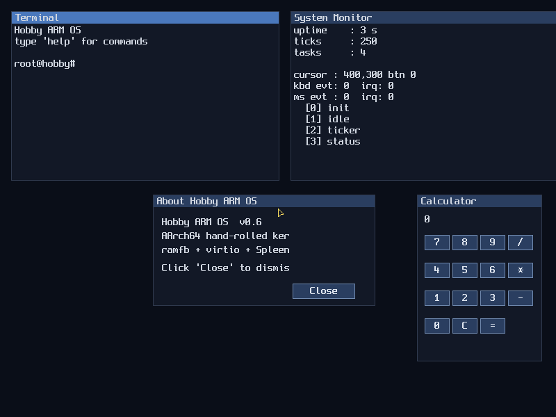

# Hobby ARM Operating System

A minimal, hand-rolled AArch64 kernel built from scratch for fun and learning.

It boots like a tiny PC: HobbyBIOS POST screen lists the detected CPU,
memory, framebuffer, storage, console, MMU, heap, scheduler, GIC, virtio
keyboard / block / network and PSCI power services line by line, then
drops into an interactive shell with a multi-task scheduler, a syscall
dispatcher, a built-in package manager and account system, and a small
catalog of user-style programs you can `run`.

The same source tree builds for two targets:

| Target      | Where it runs                                    |
|-------------|--------------------------------------------------|
| `qemu-virt` | Any host with QEMU — macOS, Linux, Windows-on-ARM, Windows x64 |
| `raspi5`    | Raspberry Pi 5 real hardware (SD card boot)      |

---

## What it does

`make run-graphic` opens a QEMU window. The kernel performs a small
PC-style POST that lists the detected CPU, memory, GPU, storage,
console and power services line-by-line, then drops into an interactive
shell — all rendered onto a ramfb framebuffer so the window looks like
a tiny PC booting:



`make run` does the same boot but without the window — output and
input go directly to your terminal, which is handy for headless hosts
or when you just want a Linux-shell feel:

```
================================================================
 HobbyBIOS v0.3  (board: qemu-virt)
 (c) 2026  Hobby ARM Operating System
================================================================

Performing power-on self test...

[ OK ] CPU       ARM Cortex-A72  (EL1)
                 MIDR_EL1=0x410fd083  MPIDR=0x80000000
                 system timer 62.5 MHz
[ OK ] Memory    256 MiB total
                 kernel  0x40000000 .. 0x401e9c10
[ OK ] Display   ramfb 800x600 XRGB8888 (host window)
[ OK ] Storage   RAM filesystem  16 slots x 4 KiB = 64 KiB
[ OK ] Console   PL011 UART @ 0x9000000
[ OK ] Power     PSCI hypercalls: SYSTEM_OFF, SYSTEM_RESET

----------------------------------------------------------------
 Boot complete. Type 'help' for commands.
----------------------------------------------------------------

hobby# uname -a
Hobby ARM OS v0.2 aarch64 qemu-virt ARM Cortex-A72
hobby# write notes Hobby ARM OS calisiyor
wrote 23 bytes to notes
hobby# ls
  notes                            23 bytes
hobby# cat notes
Hobby ARM OS calisiyor
hobby# halt
system halted.
```

In `run-graphic` the same output also goes to the QEMU window via the
framebuffer text console, while keyboard input is read from your
terminal — a USB keyboard driver to make the window fully interactive
is on the roadmap.

## Built-in commands

| Command           | Description                              |
|-------------------|------------------------------------------|
| `help`            | List all commands                        |
| `echo <text...>`  | Print arguments                          |
| `clear`           | Clear the screen (ANSI)                  |
| `ls`              | List files in the RAM filesystem         |
| `cat <name>`      | Print a file                             |
| `write <name> <text...>` | Create or overwrite a file        |
| `touch <name>`    | Create an empty file                     |
| `rm <name>`       | Delete a file                            |
| `uname [-a]`      | OS / arch / board / CPU info             |
| `cpuinfo`         | MIDR, MPIDR, current EL, counter freq    |
| `meminfo`         | Kernel image + stack layout, fs usage    |
| `uptime`          | Seconds since boot (from `cntpct_el0`)   |
| `halt`            | Power off via PSCI `SYSTEM_OFF`          |
| `reboot`          | Reset via PSCI `SYSTEM_RESET`            |

The filesystem holds up to 16 files of 4 KB each, all in RAM — there is no
backing store yet, so contents vanish at reboot.

## How it works

1. CPU starts at `_start` in [`src/boot.S`](src/boot.S).
2. Non-zero cores park in `wfi`.
3. Core 0 sets up a stack, zeroes `.bss`, and branches to `kernel_main` in C.
4. `kernel_main` initializes the UART and the in-memory filesystem.
5. On QEMU `virt`, it talks to the `fw_cfg` device, hands it a ramfb
   config (XRGB8888, 800×600), and brings up a framebuffer text console
   using a public-domain 8×8 bitmap font.
6. Runs the POST sequence — each line is printed with a small delay
   so it actually feels like a machine going through self-test.
7. Drops into the shell loop: read a line over UART (echoed to both the
   serial console and the framebuffer), tokenize on whitespace, dispatch
   to a command function from a static table.

The PL011 register layout is identical between QEMU's `virt` machine and the
Raspberry Pi 5, so the per-board differences boil down to:

- the UART base address (`src/board/<name>.h`)
- the kernel load address (`linker/<name>.ld`)
- whether the board has a `ramfb` framebuffer (`BOARD_HAS_RAMFB`)
- a board name used by `uname` and `meminfo`

## Requirements

- `aarch64-elf-gcc` and `aarch64-elf-binutils` — cross compiler
- `qemu-system-aarch64` — for running without hardware
- `make`

### macOS

```
brew install qemu aarch64-elf-gcc aarch64-elf-binutils
```

### Linux

```
sudo apt install qemu-system-arm gcc-aarch64-linux-gnu
make CROSS=aarch64-linux-gnu-
```

### Windows on ARM

Install QEMU from [qemu.org](https://www.qemu.org/download/), grab a prebuilt
`aarch64-elf` GCC toolchain (or use WSL), then run `make` the same way.

## Build & run

```
# Default target is qemu-virt
make                # build kernel.elf + kernel.img
make run            # boot to a serial shell in your terminal
make run-graphic    # also open a QEMU window with the framebuffer
make run-vnc        # full mouse + keyboard interaction via VNC
make screenshot     # boot headless and dump the framebuffer to PNG

# Raspberry Pi 5 image
make BOARD=raspi5
# → build/raspi5/kernel_2712.img
```

Press `Ctrl-A` then `X` to quit the serial shell. In `run-graphic`, close the
QEMU window or use the `halt` command from the shell.

### Why three different `run` targets?

`run-graphic` opens a QEMU window via macOS Cocoa, which is great for
*looking* at the desktop but doesn't reliably forward host mouse and
keyboard events into the virtio-input devices. Use `run-vnc` for a real
interactive session: QEMU starts a VNC server on port 5901, and the
built-in macOS Screen Sharing client (`open vnc://localhost:5901`)
captures pointer + key events and pumps them straight through to the
guest. From there, the cursor follows the trackpad, buttons fire, and
arrow keys / Esc navigate the desktop just like on a real machine.

`run` is the headless serial shell — handy when you don't need the
graphical desktop at all. The shell also has a `mouse` command
(`mouse right 200`, `mouse to 470 410`, `mouse click`) so you can
drive the cursor over the serial line if no GUI input is available.

### Booting on a real Raspberry Pi 5

1. Format an SD card as FAT32.
2. Copy the Pi firmware files (`bootcode.bin`, `start4.elf`, `fixup4.dat`,
   `bcm2712-rpi-5-b.dtb`, etc.) from the official
   [Raspberry Pi firmware repo](https://github.com/raspberrypi/firmware) onto it.
3. Copy `build/raspi5/kernel_2712.img` to the SD card root.
4. Add a `config.txt` with:

   ```
   arm_64bit=1
   kernel=kernel_2712.img
   enable_uart=1
   ```

5. Wire up a USB-to-UART adapter to GPIO14/15, open it at 115200 8N1, boot
   the Pi. The shell prompt comes up over the serial line; commands like
   `cpuinfo` will report the actual Pi 5 CPU (Cortex-A76).

## Project layout

```
hobby-os/
├── Makefile
├── README.md
├── assets/
│   └── qemu-bios-post.png
├── src/
│   ├── boot.S            # AArch64 entry, stack + .bss setup
│   ├── kernel.c          # kernel_main, boot banner
│   ├── uart.c, uart.h    # PL011 driver (TX + RX)
│   ├── console.c, console.h  # putc/puts/printf, line editor
│   ├── str.c, str.h      # mem*/str*/printf core
│   ├── shell.c, shell.h  # parser + command table
│   ├── fs.c, fs.h        # 16-slot RAM filesystem
│   ├── sysinfo.c, sysinfo.h  # MIDR/MPIDR/CNT* readers
│   ├── psci.c, psci.h    # PSCI HVC for halt/reset
│   ├── exceptions.c/.h   # VBAR setup, irq_enable, irq_handler dispatch
│   ├── vectors.S         # AArch64 EL1 vector table (IRQ entry)
│   ├── gic.c, gic.h      # GIC v2 distributor + CPU interface
│   ├── timer.c, timer.h  # ARM generic timer @ 100 Hz tick
│   ├── virtio.c, virtio.h          # virtio-mmio device discovery
│   ├── virtio_input.c, virtio_input.h  # virtio-input keyboard driver
│   ├── fb.c, fb.h        # ramfb framebuffer + glyph drawing
│   ├── fb_console.c, fb_console.h  # text terminal on the framebuffer
│   ├── fw_cfg.c, fw_cfg.h  # QEMU fw_cfg DMA client
│   ├── font.c, font.h    # public-domain 8×8 bitmap font (ASCII 0-127)
│   └── board/
│       ├── qemu-virt.h
│       └── raspi5.h
├── linker/
│   ├── qemu-virt.ld      # load at 0x40000000
│   └── raspi5.ld         # load at 0x80000
└── scripts/
    ├── run-qemu.sh
    └── screenshot.sh
```

## Roadmap

**v0.6 — desktop with windows, widgets and a calculator.** The
framebuffer now hosts a real (small) desktop with multiple windows
(Terminal, System Monitor, About, Calculator), click-to-focus,
title-bar drag, label/button widgets and an actual on_click stack
machine driving the calculator display.

Phases delivered so far:

- [x] **A** GIC v2 + ARM generic timer + PL011 RX interrupts
- [x] **B** virtio-keyboard (host keyboard goes straight to the shell)
- [x] **C** MMU identity map, kernel heap, cooperative scheduler with
       idle/ticker/status threads, SVC syscall dispatcher, first user-style
       program
- [x] **D** Live framebuffer status bar + multiple built-in apps
- [x] **E** virtio-blk device discovery + filesystem save/load surface
       (write submit path still WIP)
- [x] **F** virtio-net device discovery + MAC reading + `ifconfig`
- [x] **G** User accounts (login / whoami / logout) + a built-in
       package manager (`pkg list/install/remove`)

Scaffolding now in place (each one started, not all complete):

- [~] virtio-mouse + framebuffer cursor sprite (mouse moves the
      cursor in real time when the QEMU window has focus)
- [~] PSCI `CPU_ON` secondary-core wakeup + per-CPU stacks
      (kernel POSTs an SMP line; full SMP scheduler is the follow-up)
- [~] AArch64 ELF64 loader (`elfinfo` validates and inspects ELF
      files in the RAM fs; jumping into them needs the EL0 fix)
- [~] Pi 5 GIC + UART IRQ numbers in board header (port still
      compile-out until real-hardware bring-up)

Known issue, top of the follow-up list:

- Driver-side virtio queue **write** path doesn't reach the device on
  QEMU 11 + macOS aarch64. Symptom: virtio-input/tablet IRQs never
  fire (`kbd evt: 0  irq: 0` in System Monitor) so cursor and
  keyboard events from the QEMU window or VNC client never reach the
  guest. Same root cause as virtio-blk save hanging at status=0xff.
  Workaround today: drive the cursor and click from the serial-line
  shell (`mouse right 200`, `mouse to X Y`, `mouse click`). Real fix
  needs cache invalidation around the virtq + a virtio-input
  capability probe (or a switch to virtio-pci transport).

Open work, in rough order:

- [ ] Pull AP=01 page permissions out of the 1 GiB blocks so user
      programs can really run at EL0 with isolation
- [ ] Finish the virtio-blk write submit path so `save`/`load`
      land bytes on disk
- [ ] Real TCP/IP stack on top of the virtio-net link layer
- [ ] Per-CPU run queues so the secondaries from CPU_ON actually
      schedule tasks instead of parking in WFI
- [ ] Wire the ELF loader through `run <name>` once we have a
      proper user-mode loader path

## License

MIT.
