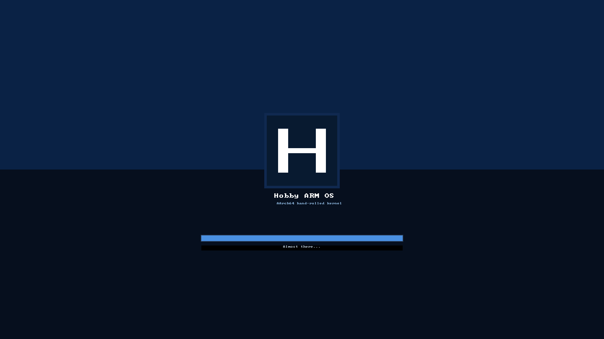
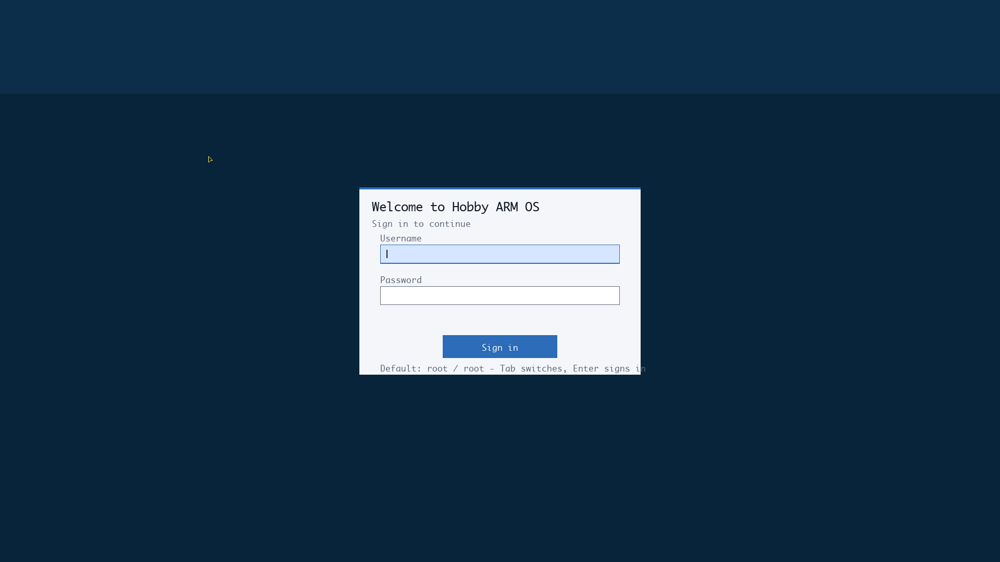
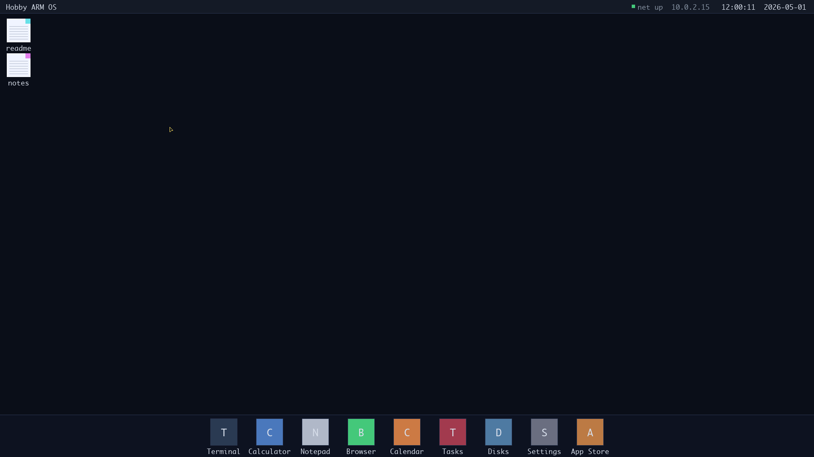
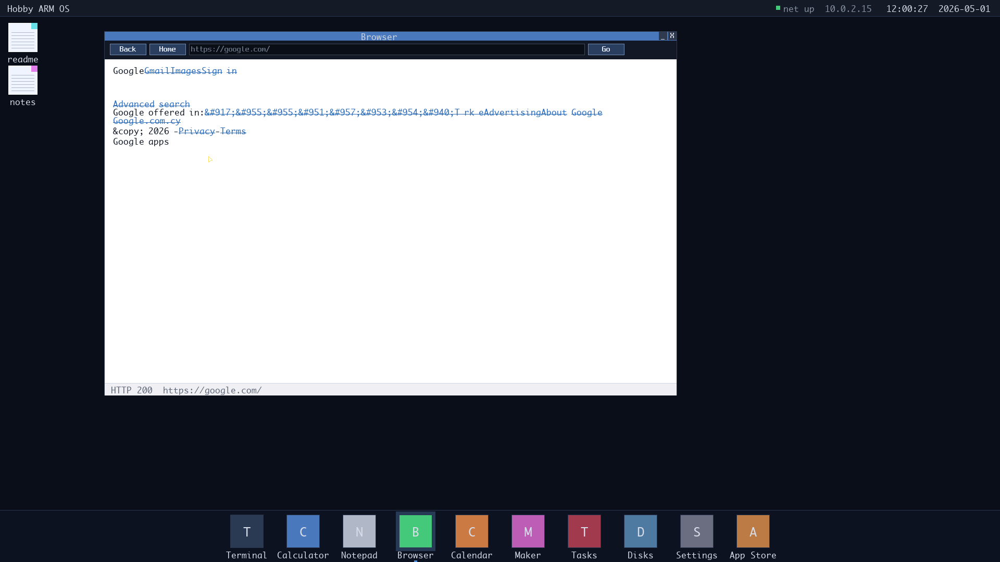
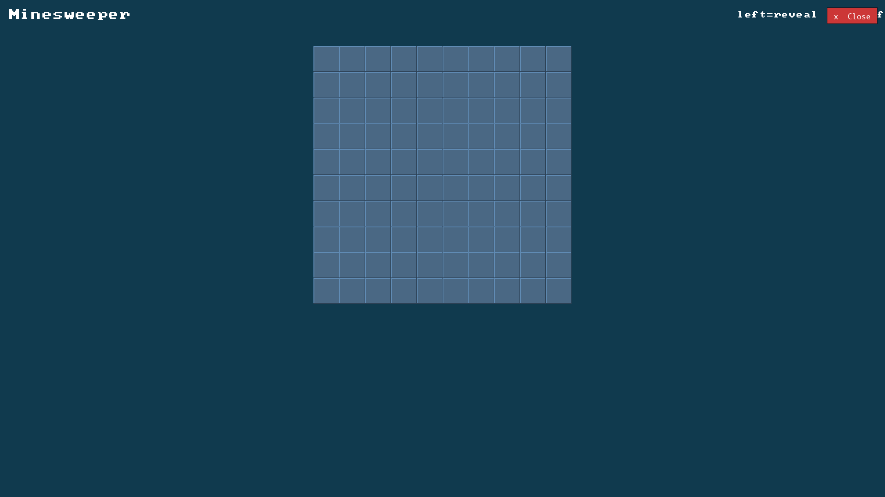
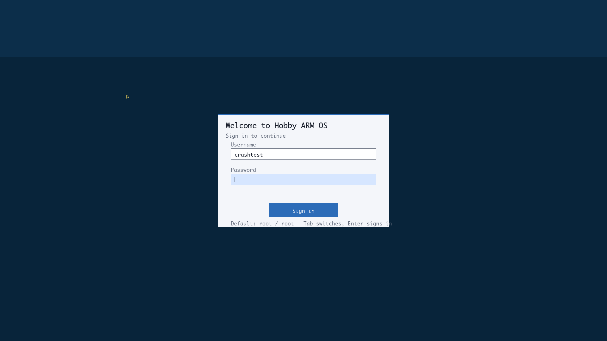

# Hobby ARM Operating System

A hand-rolled **AArch64 (ARM 64-bit)** hobby operating system, built
from scratch in C and assembly with **Claude AI** as a pair-
programming partner. No code is borrowed from another OS; everything
from the boot stub to the HTTPS-capable browser was written for this
project, line by line.

It boots in QEMU at **1920×1080**, lands on a graphical boot splash,
asks the user to log in, and drops onto a macOS-flavoured desktop
with a dock, draggable file icons, animated windows, a working
TCP/IP stack, a real HTML browser, a package manager, a Scratch-
style block-programming app and an online marketplace backend.



---

## Highlights

| | |
|---|---|
| **Architecture** | AArch64 / ARMv8-A (Cortex-A72 in QEMU, designed for Cortex-A76 on Pi 5) |
| **Boot** | Custom boot.S → MMU (4 KiB granule, 39-bit VA) → GIC v2 → exception vectors → cooperative scheduler → user EL1h |
| **Display** | ramfb @ 1920×1080 XRGB8888, double-buffered compositor with anti-aliased Monaco font |
| **Networking** | Hand-rolled TCP/IP stack — ARP, ICMP, TCP, UDP, DNS, HTTP/1.0 + HTTPS via proxy |
| **Storage** | virtio-blk with auto-saving on-disk filesystem and a SHA-256 verified package store |
| **User mode** | Cross-compiled ELFs run at EL1h via SVC syscalls; minesweeper / sudoku / hello / counter / clock / load / files / sysinfo |
| **GUI** | macOS-style dock + top bar, animated minimize/restore, multi-select, drag-drop, right-click menus, rename, folders |
| **Apps** | Terminal, Calculator, Notepad, Browser, Calendar, Tasks, Disks, Settings, App Store, Maker |
| **Crash** | Save / Report / Close modal instead of a kernel panic — fs flushes to disk, /crash.log gets written |

---

## Screens

### Login



A graphical login gate (default: `root` / `root`) backed by `accounts.c`.
Tab switches fields, blinking caret, mouse hit-tests on click.

### Desktop



Top bar (clock / date / network status), draggable file icons on the
wallpaper, dock at the bottom with built-ins (Terminal, Calculator,
Notepad, Browser, Calendar, Maker, Tasks, Disks, Settings, App Store).
Open apps light up with a halo + indicator dot. Wallpaper persists
across reboots.

### Browser — actual HTTPS browsing



The browser parses HTML, renders headings / lists / links / `<hr>`
with the smooth font, supports clickable navigation + history. Plain
HTTP goes direct; **HTTPS routes through a `/proxy` endpoint on the
marketplace backend** — Python handles TLS for us so the kernel stays
small. Type `https://google.com/` and Google's actual home page
loads.

### Fullscreen game with a kernel-overlaid Close button



User-mode programs that call `SYS_GUI_TAKE` get the framebuffer to
themselves. The kernel transparently overlays a red **Close** button
top-right on every `SYS_GUI_PRESENT`; clicking it kills the owning
task and brings the desktop back. Both Minesweeper and Sudoku ship
as installable packages from the repo.

### Crash modal



When the kernel hits an unrecoverable fault, instead of halting in
WFI it paints a centered card over a deep blue field. **Save**
flushes the filesystem to virtio-blk, **Report** writes the panic
info (ESR_EL1, ELR_EL1, fault classification) to `/crash.log`, and
**Close** powers off cleanly via PSCI.

---

## How it actually works

1. CPU starts at `_start` in `src/boot.S`. Non-zero cores park in WFI;
   core 0 sets up a stack, zeroes BSS, branches to `kernel_main` in C.
2. `mmu_init` builds a 4 KiB-granule pgtable identity-mapping the
   first 4 GiB (0–1 GiB device, 1–2 GiB RAM, 2–4 GiB also normal).
3. GIC v2 + exception vectors come up; the timer fires at 250 Hz.
4. virtio drivers (input, mouse, blk, net) probe the MMIO bus and
   register IRQs.
5. fb_init talks to QEMU's `fw_cfg` to register a ramfb framebuffer at
   1920×1080 XRGB8888. Two pixel buffers (front / back) live in BSS
   for tear-free presentation.
6. The graphical boot splash paints over a vertical blue gradient with
   a logo card and progress bar. POST status is also written to UART
   for headless logs.
7. `login_run` takes the framebuffer, polls keyboard and mouse, and
   only returns once `accounts.c` accepts a credential.
8. The cooperative scheduler comes online: `idle`, `ticker`,
   `status_thread`. `status_thread` does the compose loop — wallpaper,
   icons, windows (back to front), top bar + dock + context menu,
   cursor, present.
9. `shell_run` reads commands from UART or from the in-window
   Terminal once the user opens it.

The `Tasks` window's advanced mode shows live `ran_ticks`, %CPU,
stack size, and kernel/user kind for every task.

---

## Networking from scratch

Layer-by-layer, all in `src/`:

- **virtio-net** (`virtio_net.c`) — TX/RX virtqueues, DMA cache flushes
  via `dc cvac` / `dc ivac`, MAC negotiation
- **Ethernet + ARP** (`net.c`) — broadcast resolve, single-entry cache,
  reply path for incoming queries
- **IPv4** (`net.c`) — header build/parse, dispatch by protocol
- **ICMP echo** (`net.c`) — handles incoming pings + sends our own
  via `net_ping` (used by the `ping` shell command)
- **UDP** (`net.c`) — datagram build/dispatch
- **DNS** (`dns.c`) — A-record query against `10.0.2.3:53` (slirp's
  resolver), in-flight matching by transaction id + source port
- **TCP** (`tcp.c`) — single-connection blocking, three-way handshake,
  proper window advertising, retransmit on no-ACK loop, FIN/CLOSE_WAIT
- **HTTP/1.0** (`http.c`) — `GET` and `POST` with status-line parse and
  header skip
- **HTTPS** — proxied through the marketplace backend's `/proxy?url=…`
  endpoint, since a real TLS stack is its own multi-week project

`ping`, `nslookup`, `ifconfig` are all in the shell. Every wait loop
yields cooperatively so the desktop stays responsive even during
network round-trips.

---

## Package manager + marketplace

`tools/repo/` is a Docker-served HTTP catalog with one manifest per
package (name, version, license, sha256, declared syscalls, exec
path). On the OS side, `pkg install <name>` does a real download:

```
GET /packages/<name>/manifest.json    -> parse sha256 + size
GET /packages/<name>/<name>.elf       -> 67 KiB ELF
verify SHA-256
write to pkgstore (dedicated region of virtio-blk)
```

`run <name>` reads the binary back, `elf_load`s its PT_LOAD segments
to `0x4F000000`, and `task_spawn_user`s the entry. Across reboots the
pkgstore survives, so installed apps come back automatically.

`tools/marketplace/` extends the repo with a Python + SQLite backend
for **community-uploaded programs** (Maker JSON):

```
GET  /community              # list / search (?q=)
POST /community              # upload {name, author, summary, code}
GET  /community/<id>         # bumps download count
GET  /community/<id>/comments
POST /community/<id>/comments
POST /community/<id>/rate    # 1..5 stars
GET  /proxy?url=https://...  # TLS fetcher used by the in-OS browser
```

Ships with `Dockerfile` + `railway.json`. `make mkt-rebuild` runs it
locally; deploy to Railway with `railway up` plus a Volume on `/data`
for SQLite persistence. The OS-side talks to it at
`http://10.0.2.2:8090` from inside QEMU.

### Maker — block-style programming

The Maker app composes programs from blocks (Print, Set, If, Repeat,
End), runs them in-process via a small interpreter, saves them to
`/maker/<name>` in the local fs, and uploads them to `/community` so
others can browse + rate them.

---

## Built into the dock

| App | What it does |
|---|---|
| **Terminal** | Live shell, attaches to the system console |
| **Calculator** | Stack-machine calculator with widget buttons |
| **Notepad** | Edit any file picked via desktop double-click; Save persists; auto-flush to virtio-blk |
| **Browser** | HTML parser + link navigation; HTTPS via proxy |
| **Calendar** | Current month grid, today bracketed (Zeller's congruence) |
| **Maker** | Block-style programming with marketplace upload |
| **Tasks** | Live task table with Simple/Advanced modes (PID, ticks, %CPU, kind, stack) |
| **Disks** | fs file listing + virtio-blk capacity |
| **Settings** | Wallpaper picker, account, network status |
| **App Store** | Install / remove packages from the marketplace |

---

## Targets

| Target      | Where it runs                                             |
|-------------|-----------------------------------------------------------|
| `qemu-virt` | Any host with QEMU — macOS, Linux, Windows-on-ARM, Windows x64 |
| `raspi5`    | Raspberry Pi 5 real hardware (SD-card boot)               |

The PL011 register layout is identical between QEMU's `virt` machine
and the Pi 5, so per-board differences boil down to:

- UART base address (`src/board/<name>.h`)
- kernel load address (`linker/<name>.ld`)
- whether the board has a `ramfb` framebuffer (`BOARD_HAS_RAMFB`)
- a board name used by `uname` and `meminfo`

---

## Requirements

- `aarch64-elf-gcc` and `aarch64-elf-binutils` — cross compiler
- `qemu-system-aarch64`
- `make`
- `docker` (only for the package repo / marketplace)
- `python3 + Pillow` (only if you want to regenerate the smooth font
  atlas via `tools/gen_font.py`)

### macOS

```sh
brew install qemu aarch64-elf-gcc aarch64-elf-binutils
```

### Linux

```sh
sudo apt install qemu-system-arm gcc-aarch64-linux-gnu
make CROSS=aarch64-linux-gnu-
```

### Windows on ARM

Install QEMU from [qemu.org](https://www.qemu.org/download/), grab a
prebuilt `aarch64-elf` GCC toolchain (or use WSL), then run `make`
the same way.

---

## Build & run

```sh
# default target is qemu-virt
make                 # build kernel.elf + kernel.img + disk.img
make run             # boot to a serial shell
make run-graphic     # also open a QEMU window (macOS Cocoa)
make run-vnc         # VNC server on :5901 for full mouse + keyboard
make screenshot      # boot headless and dump the framebuffer to PNG

# package + marketplace
make repo-rebuild    # rebuild the simple Docker package repo
make mkt-rebuild     # rebuild the full marketplace (community + /proxy)

# raspberry pi 5 image
make BOARD=raspi5
# -> build/raspi5/kernel_2712.img
```

Press `Ctrl-A` then `X` to quit the serial shell. In `run-graphic`,
close the QEMU window or use the `halt` command.

### Why three different `run` targets?

`run-graphic` opens a QEMU window via macOS Cocoa, which is great
for *looking* at the desktop but doesn't reliably forward host
mouse and keyboard events into the virtio-input devices. Use
`run-vnc` for a real interactive session: QEMU starts a VNC server
on port 5901, and the built-in macOS Screen Sharing client
(`open vnc://localhost:5901`) captures pointer + key events and
pumps them straight through to the guest.

`run` is the headless serial shell — handy for debugging, and the
shell has a `mouse` command (`mouse right 200`, `mouse to 470 410`,
`mouse click`) so you can drive the cursor without a GUI.

### Booting on a real Raspberry Pi 5

1. Format an SD card as FAT32.
2. Copy the Pi firmware files (`bootcode.bin`, `start4.elf`,
   `fixup4.dat`, `bcm2712-rpi-5-b.dtb`, etc.) from the official
   [Raspberry Pi firmware repo](https://github.com/raspberrypi/firmware).
3. Copy `build/raspi5/kernel_2712.img` to the SD card root.
4. Add a `config.txt` with:

   ```
   arm_64bit=1
   kernel=kernel_2712.img
   enable_uart=1
   ```

5. Wire up a USB-to-UART adapter to GPIO14/15, open it at 115200 8N1,
   boot the Pi. The shell prompt comes up over the serial line;
   commands like `cpuinfo` will report the actual Pi 5 CPU
   (Cortex-A76).

---

## Project layout

```
hobby-os/
├── Makefile
├── README.md
├── assets/                       # README screenshots
├── src/
│   ├── boot.S                    # AArch64 entry, stack + .bss setup
│   ├── kernel.c                  # kernel_main, POST, app launchers
│   ├── boot_splash.c, .h         # graphical boot splash
│   ├── login.c, .h               # full-screen login gate
│   ├── desktop.c, .h             # icons, dock, top bar, context menu
│   ├── window.c, .h              # window manager + widget tree
│   ├── wallpaper.c, .h           # 8 baked-in wallpapers, persisted
│   ├── browser.c, .h             # HTML parser + link navigation
│   ├── maker.c, .h               # block-style programming app
│   ├── panic.c, .h               # Save / Report / Close crash modal
│   ├── fb.c, .h                  # ramfb + alpha-blended glyph render
│   ├── font.c                    # Spleen 8x16 fallback bitmap font
│   ├── font_smooth.h             # auto-gen Monaco atlas (UI + heading)
│   ├── fb_console.c, .h          # text terminal on the framebuffer
│   ├── fw_cfg.c, .h              # QEMU fw_cfg DMA client
│   ├── uart.c, .h                # PL011 driver
│   ├── console.c, .h             # putc/puts/printf, line editor
│   ├── str.c, .h                 # mem*/str*/printf core
│   ├── shell.c, .h               # parser + command table
│   ├── fs.c, .h                  # 16-slot RAM fs + auto-save
│   ├── pkgmgr.c, .h              # catalog + install/remove/run
│   ├── pkgstore.c, .h            # virtio-blk-backed package binaries
│   ├── sha256.c, .h              # SHA-256 for package verification
│   ├── elf.c, .h                 # AArch64 ELF64 loader
│   ├── exceptions.c, .h          # IRQ + sync handler dispatch
│   ├── vectors.S                 # AArch64 EL1 vector table
│   ├── gic.c, .h                 # GIC v2
│   ├── timer.c, .h               # ARM generic timer @ 250 Hz tick
│   ├── task.c, .h, switch.S      # cooperative scheduler + ctx switch
│   ├── syscall.c, .h             # SVC dispatch (write/exit/yield/gui_*)
│   ├── mmu.c, .h                 # 4 KiB granule, 39-bit VA pgtable
│   ├── psci.c, .h                # PSCI HVC for halt/reset
│   ├── virtio.c, .h              # virtio-mmio device discovery + DMA
│   ├── virtio_input.c, .h        # virtio-keyboard
│   ├── virtio_mouse.c, .h        # virtio-tablet
│   ├── virtio_blk.c, .h          # virtio-blk
│   ├── virtio_net.c, .h          # virtio-net TX/RX
│   ├── net.c, .h                 # Ethernet/ARP/IPv4/ICMP/UDP
│   ├── tcp.c, .h                 # TCP state machine
│   ├── dns.c, .h                 # DNS resolver
│   ├── http.c, .h                # HTTP/1.0 GET + POST
│   ├── sysinfo.c, .h             # MIDR/MPIDR/CNT* readers
│   ├── user_program.c, .h        # built-in fallbacks (hello, counter…)
│   └── board/{qemu-virt,raspi5}.h
├── linker/{qemu-virt,raspi5}.ld
├── scripts/
│   ├── run-qemu.sh
│   └── screenshot.sh
└── tools/
    ├── sdk/                      # cross-compile SDK for user packages
    │   ├── hobby_sdk.h           # syscall wrappers + helpers
    │   ├── crt0.S                # _start -> hobby_main -> sys_exit
    │   ├── user.ld               # link at 0x4F000000
    │   └── build_pkg.sh          # rasterizes ELF + updates manifest
    ├── repo/                     # simple HTTP package repo (Docker)
    │   ├── Dockerfile
    │   ├── serve.py
    │   ├── index.html
    │   ├── index.json
    │   └── packages/<name>/      # manifest.json + .elf + source/
    ├── marketplace/              # community marketplace + /proxy
    │   ├── Dockerfile
    │   ├── railway.json
    │   ├── README.md
    │   └── server.py             # SQLite + /community + /proxy?url=
    └── gen_font.py               # rasterize TTF into a smooth atlas
```

---

## Roadmap / known gaps

Done so far (in commit order, with screenshots above):

- [x] PL011 UART, GIC v2, ARM generic timer, MMU
- [x] virtio-input keyboard + virtio-tablet mouse + cursor sprite
- [x] virtio-blk + on-disk filesystem (`HBFS` magic), auto-save
- [x] virtio-net + ARP + ICMP echo (replies + outbound `ping`)
- [x] TCP three-way handshake + flow control + FIN
- [x] DNS resolver (UDP) for non-numeric hostnames
- [x] HTTP/1.0 client (GET + POST)
- [x] **HTTPS via marketplace `/proxy`** (real internet sites work)
- [x] Cooperative scheduler with idle/ticker/status threads, SVC syscalls
- [x] Cross-compile SDK + ELF loader; user-mode apps run at EL1h
- [x] Real package manager: download + SHA-256 verify + persist + run
- [x] Graphical boot splash + login gate + 1920×1080 framebuffer
- [x] macOS-flavoured desktop: dock, icons, drag-drop, multi-select,
      animated minimize/restore, right-click menus, rename, folders
- [x] Anti-aliased font (Monaco atlas, alpha-blended)
- [x] Built-in apps: Terminal, Calculator, Notepad, Browser, Calendar,
      Maker, Tasks, Disks, Settings, App Store
- [x] Minesweeper + Sudoku as installable packages with kernel-overlaid
      Close button
- [x] Save / Report / Close crash modal in place of kernel panic
- [x] Wallpaper picker (8 presets) persisted to `/etc/wallpaper`
- [x] Maker block-style programming + Railway-deployable marketplace
      backend (community programs, ratings, comments, search)

Open gaps and follow-ups:

- [ ] Real EL0 isolation (split 1 GiB blocks into 2 MiB pages so user
      code can have its own AP=01 mapping)
- [ ] Real TLS in the kernel (TLS 1.3 + AES-GCM + ECDH + X.509) instead
      of the proxy workaround
- [ ] Pre-emptive scheduler instead of cooperative
- [ ] SMP scheduling on the secondary cores brought up by PSCI CPU_ON
- [ ] Pi 5 hardware bring-up (board header is in place, GIC IRQ
      numbers + drivers need to be ported)
- [ ] HTML entity decoder for `&#NNN;` references + Unicode glyphs
      (Monaco atlas is ASCII only today)
- [ ] Folder hierarchy in fs (one level today via path-prefix names)
- [ ] In-OS Community browser tab in the App Store (backend is ready,
      vitrine UI is missing)

---

## Built with

- C11 + AArch64 assembly, no external libraries in the kernel
- QEMU `virt` for emulation, `ramfb` for the framebuffer
- Docker for the package repo / marketplace
- Python 3 + SQLite for the marketplace backend
- Pillow + a system Monaco TTF for the smooth-font atlas (one-shot)
- **Claude AI** as a pair-programming partner throughout

---

## License

MIT.
